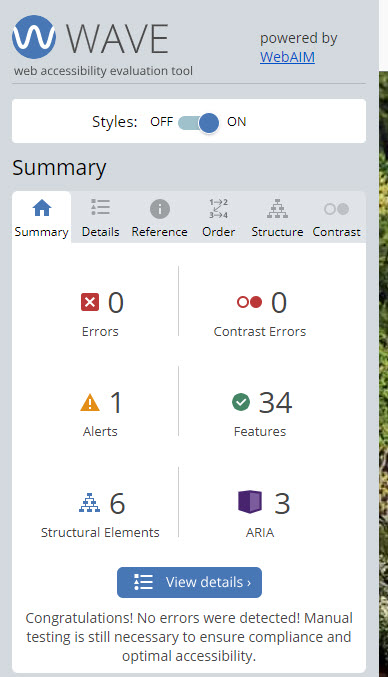

## Golfer Memory Game

The worlds top golfers themed memory card game where the user's aim is to find all matching picture cards in as little time as possiple and in the least amount of Putts (moves).

Link to [live site](https://patrickg0308.github.io/PP2-GolferMem/)

## Index - Table of Contents

- [Features](#features)
    - [Existing Features](#existing-features)
    - [Future Features](#possible-future-features)

- [UX](#ux)
    - [Site Goals](#site-goals)
    - [User Stories](#user-stories)

- [Testing](#testing)
    - [Validator Testing](#validator-testing)
    - [Browser Testing](#browser-testing)
    - [Fixed Bugs](#fixed-bugs)
    - [Unfixed Bugs](#unfixed-bugs)

- [Deployment](#deployment)

- [Credits](#credits)
    - [Media](#media)
    - [Code](#code)
    - [Content](#content)

## Features

The site contains all necessary features of a simple, functioning memory card game.

### Existing Features

- **Start Page with Start Game Button (Tee Off!)**
    - Displays when site first loads
    - Instructions on "How to Play" are displayed	
    - Game starts immediately when Start (Tee Off) button is pressed.  	

    

- **Game Area**
    - The main feature of the site
    - A grid of 12 cards (6 matching pairs), depicting various world class golfers. 
    - Cards appear face down at the start of the game.
    - On click, cards are turned face up. Matching pairs remain face up. Non-matching cards get flipped back face down.

    

- **Timer and Moves Counter**
    - On large screens the move (putts) counter is positioned at the top right area
    - On large screens the Timer counter is positioned at the top left area	
    - Timer starts as soon as user clicks the Tee Off button on the start page or when they click the first card after pressing the reset button
    - Timer stops when game is completed
    - Moves counter increments by 1 every time the user clicks on a card

    

- **Reset Button**
    - Permanently appears below the flipcard area 
    - On click, resets the timer, move counter and current score counter to 0
    - Timer starts after user clicks the first card	
    
    

- **Game Complete** 
   - Displays modal outlining no of Putts (moves).
   - Displays the total elapsed time to complete game
   - Displays GIF of Bryson DeChambeau performing a golfers clap.	

- **Footer**
    - Located at the bottom of the start page
    - Contains social media icons which link to site creater's Twitter and LinkedIn profile, as well as the open-source GitHub repo of the site

    

### Possible Future Features

- **Add audio**
    - Enables user to play and pause sky sports golf theme tune
    - Enable the user to toggle sound effects for flipping the cards and completing the game
    - Enable the user to choose a theme

- **Rotate Background Image**
    - Depict images of world famous golf holes
    - Depict images of world famous golf courses 

## UX

### Site Goals

The goal of the site is to provide Golf Fans with an entertaining yet not too complicated game, featuring images of the worlds top Golfers.

The game is intended to be played over the course of a few minutes. It does not take up too much of the user's time either by playing or learning the rules and functionality.

### User Stories

**As a site visitor I want to:**

- get a quick and thorough overview of the sites features and functionalities
- read a brief and simple description of how to play
- be able to play the game with simple click interaction
- see the time that has elapsed while playing the game
- see a move (putt) counter recording the amount of clicks I perform
- be able to restart the game without reloading the page
- be able to find the site's creator on social media and GitHub

**As the site administrator I want to:**

- be able to make modifications to the game (see [future features](#possible-future-features))
- provide the user with social media contacts
- offer the user the chance to explore the code for the site

## Testing

### Validator Testing

- HTML ([W3C validator](https://validator.w3.org/))

    

- CSS [Jigsaw](https://jigsaw.w3.org/css-validator/)

    

- JavaScript [JSHint](https://jshint.com/)

    

- Performance, Accessibility, SEO, Best Practices (Lighthouse Chrome DevTools)

    

- WAVE (powered by WebAIM)

    

### Browser Testing

**Layout:** Testing layout and appearance of site for consistency throughout browsers.

**Functionality:** 
- Testing complete functionality of the game. This includes:
    - Start Page
    - Start button functionality	
    - Game function 
    - Timer
    - Move Counter

| Browser     | Layout      | Functionality |
| :---------: | :----------:| :-----------: |
| Chrome      | ✔          | ✔             |
| Edge        | ✔          | ✔             |
| Firefox     | ✔          | ✔             |
| Safari      | ✔          | ✔             |

### Fixed bugs

bookmarking social media icons to open page

### Unfixed bugs

responsiveness of game area on small screens

## Deployment

This site was deployed via GitHub pages using the following steps:
- From the GitHub repository, navigate to **Settings**
- In the left-hand navigation section select **Pages**
- From the source section drop-down menu change Branch from **none** to **main** and click the **Save**
- After several minutes the website is live and will be automatically refreshed with each Git push command.

The link to the live site is: https://patrickg0308.github.io/PP2-GolferMem/

To run locally:
- Log into GitHub and click on repository to download ([PP2-GolferMem](https://patrickg0308.github.io/PP2-GolferMem/))
- Select **Code** and click "Download the Zip file.
- Once download is completed, extract ZIP file and use in your local environment.

Alternatively you can **Clone** or **Fork** this repository into your GitHub account.

## Credits

### Media

**Images:**

- Golfer images - https://www.owgr.com/current-world-ranking
- Augusta National Golf Course image - https://golf.com/
- Back Card image - https://www.pngall.com/
- favicon - https://favicon.io/
- Social Media icons - https://kit.fontawesome.com/6342b55ea1.js
- Golfer clap gif - https://giphy.com/

### Code

#### Functionality

- [Memory Card Game](https://marina-ferreira.github.io/tutorials/js/memory-game/)

- [Timer functionality](https://daily-dev-tips.com/posts/vanilla-javascript-timer/)

- [Modal](https://www.youtube.com/watch?v=TAB_v6yBXIE&ab_channel=KevinPowell)

- [Grid Column Span](https://stackoverflow.com/questions/47319464/make-a-grid-column-span-the-entire-row%20*/)

- [Align-Self](https://developer.mozilla.org/en-US/docs/Web/CSS/align-self)

- [Flex order property](https://marina-ferreira.github.io/tutorials/css/flexbox/#order)

#### Styling effects and animations
- [CSS perspective property](https://developer.mozilla.org/en-US/docs/Web/CSS/perspective)
- [CSS transform-style Property](https://developer.mozilla.org/en-US/docs/Web/CSS/transform-style)
- [Aspect Ratio](https://www.youtube.com/watch?v=gj4zoaigSqI&t=134s)

### Content
**Fonts** 

-[Google fonts](https://fonts.google.com/)

**Icons** 

All icons were taken from [Font Awesome](https://fontawesome.com/icons)