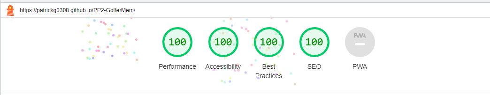

## Golfer Memory Game


The worlds top golfers themed memory card game where the user's aim is to find all matching picture cards in as little time as possiple and in the least amount of Putts (moves).

Link to [live site](https://patrickg0308.github.io/PP2-GolferMem/)

## Index - Table of Contents

- [Features](#features)
    - [Existing Features](#existing-features)
    - [Future Features](#possible-future-features)

- [UX](#ux)
    - [Site Goals](#site-goals)
    - [User Stories](#user-stories)

- [Testing](#testing)
    - [Validator Testing](#validator-testing)
    - [Browser Testing](#browser-testing)
    - [Manual Testing](#manual-testing)
    - [Fixed Bugs](#fixed-bugs)
    - [Unfixed Bugs](#unfixed-bugs)

- [Deployment](#deployment)

- [Credits](#credits)
    - [Media](#media)
    - [Code](#code)
    - [Content](#content)


## Features

The site contains all necessary features of a simple, functioning memory card game.

### Existing Features

- **Start Page with Start Game Button (Tee Off!)**
    - Displays when site first loads
    - Instructions on "How to Play" are displayed	
    - Game starts immediately when Start (Tee Off) button is pressed.  	

    

- **Footer**
    - Located at the bottom of the start page
    - Contains social media icons which link to site creater's Twitter and LinkedIn profile, as well as the open-source GitHub repo of the site

        


- **Game Area**
    - The main feature of the site
    - A grid of 12 cards (6 matching pairs), depicting various world class golfers. 
    - Cards appear face down at the start of the game.
    - On click, cards are turned face up. Matching pairs remain face up. Non-matching cards get flipped back face down.

    

- **Timer and Moves Counter**
    - The move (putts) counter is positioned at the top right area
    - The timer counter is positioned at the top left area	
    - Timer starts as soon as user clicks the Tee Off button on the start page or when they click the first card after pressing the reset button
    - Timer stops when game is completed
    - Moves counter increments by 1 every time there is a no match

    

- **Reset Button**
    - Permanently appears below the flipcard area 
    - On click, resets the timer, resets move counter to 0 and flips all cards to face down position. 
    - Timer starts after user clicks the first card	
    
    

- **Game Complete** 
   - Displays modal outlining no of Putts (moves).
   - Displays the total elapsed time to complete game
   - Displays GIF of Bryson DeChambeau performing a golfers clap.

   	


## Possible Future Features

- **Add audio**
    - Enables user to play and pause sky sports golf theme tune
    - Enable the user to toggle sound effects for flipping the cards and completing the game
    - Enable the user to choose a theme

- **Rotate Background Image**
    - Depict images of world famous golf holes
    - Depict images of world famous golf courses 

## UX

### Site Goals

The goal of the site is to provide Golf Fans with an entertaining yet not too complicated game, featuring images of the worlds top Golfers.

The game is intended to be played over the course of a few minutes. It does not take up too much of the user's time either by playing or learning the rules and functionality.

### User Stories

**As a site visitor I want to:**

- get a quick and thorough overview of the sites features and functionalities
- read a brief and simple description of how to play
- be able to play the game with simple click interaction
- see the time that has elapsed while playing the game
- see a move (putt) counter recording the amount of clicks I perform
- be able to restart the game without reloading the page
- be able to find the site's creator on social media and GitHub

**As the site administrator I want to:**

- be able to make modifications to the game (see [future features](#possible-future-features))
- provide the user with my social media contacts
- offer the user the chance to explore the code for the site


## Testing

### Validator Testing

- HTML ([W3C validator](https://validator.w3.org/))

    

- CSS [Jigsaw](https://jigsaw.w3.org/css-validator/)

    

- JavaScript [JSHint](https://jshint.com/)

    

- Performance, Accessibility, SEO, Best Practices (Lighthouse Chrome DevTools)

    

### Browser Testing

**Layout:** Testing layout and appearance of site for consistency throughout browsers.

**Functionality:** 
- Testing complete functionality of the game. This includes:
    - Start Page
    - Start button functionality	
    - Game function 
    - Timer
    - Move Counter

| Browser     | Layout      | Functionality |
| :---------: | :----------:| :-----------: |
| Chrome      | ✔          | ✔             |
| Edge        | ✔          | ✔             |
| Firefox     | ✔          | ✔             |
| Safari      | ✔          | ✔             |

### Manual Testing

| Feature     | Expect      | Action        | Result |
| :---------: | :----------:| :-----------: | :-----:|
| **Start Page**  | Displays "How to Play" instructions and start ("tee Off!") button and footer | Clicked link to Live site | Instructions on how to play appeared, Tee Off! button appeared, social media footer appeared
| **Footer** | Displays Social Media Links as icons | Clicked  individual icons | Social Media link icons open relevant websites in new tab when clicked |
| **Start Game Button**  | When clicked, the start page will close and the game starts with running timer and move counter  | Clicked Start Game button | Start Page closes, timer starts and game can be played while number of moves are counted and displayed |
| **Card flip** | When card is clicked, card flips over and shows image | Click card | Card flips and shows image |
| **Card match** | Matching card pairs remain face up | Click cards until matching pair found | Matching pair remains face up |
| **Card no-match** | Non-matching cards will flip back after 1 second | Click on non-matching cards | After 1 seconds, cards flip back face down |
| **Timer** | Timer will start running on start of game and finish running on game completion | Start game / Complete game | Timer starts running / Timer stops running |
| **Move counter** | Mover counter will imcrement by 1 each time there is a no match | Click cards | Move counter increments by 1 each time |
| **Game completion** | On finding all matching cards modal will apear summarising Number of moves(putts) and time taken also gif of golfer performing golfers clap  | Complete game - find all matching cards | Modal appears summarising time and number of moves and gif of golfer performing golfers clap |
| **Reset button** | When clicked, will reset timer, move (putt) counter to 0 and flip cards back to original position,timer will not start until the first card is clicked  | Click reset button | Cards go back to start position ; timer, move counter start from 0, timer starts when first card is clicked|


### Testing User Stories

| Expectation (As a user, I want to...)  | Result (As a user, I...)    |
| :---------------------------------: | :------------------------------:|
| Get a quick and thorough overview of the sites features and functionalities | Can find my way around the site easily and quickly with all areas being layed out intuitively |
| Read a brief and simple description of how to play | Can read the game instructions on the start page in very little time |
| Be able to play the game with simple click interactions | Play the game by simply clicking on the cards in the game area |
| See the time that has elapsed while playing the game | See a running timer above the card area for the duration of the game |
| See a move counter recording the amount of clicks I perform | See the move counter increment by 1 each time I click an unmatched pair |
| Be able to reset the game without reloading the page | Can click the reset button after completing a round and play the game again without reloading the game |
| Be able to find the site's creator on social media | Can click on the social media icons in the footer on the start page which link me to the site creator's respective accounts in new tabs |

### Fixed bugs

- bookmarking social media icons to open page
- JavaScript console error on testing
- Blip when clicking "Tee Off!" button


### Unfixed bugs

- none

## Deployment

### Version Control

The site was created using the CodeAnywhere code editor and pushed to github to the remote repository [here](https://github.com/PatrickG0308/PP2-GolferMem) .

The following git commands were used throughout development to push code to the remote repo:

```git add .```  - This command was used to add the file(s) to the staging area before they are committed.

```git commit -m “commit message”```  - This command was used to commit changes to the local repository queue ready for the final step.

```git push```  - This command was used to push all committed code to the remote repository on github.

### Deployment to Github Pages

- The site was deployed through GitHub pages. The steps to deploy are as follows:
  - In the GitHub repository, navigate to the Settings tab
  - From the menu on left under the header `Code and automation`  select `Pages`
  - Under the `Build and deployment` section under the header `Source`, I selected `Deploy from a branch`.
  - Under the next header `Branch` from the first dropdown menu I selected `main`, on the second dropdown menu I selected `root`.
  - Click `Save`
  - A live link will be displayed at the top of the GitHub Pages when published successfully.

The live link can be found [here](https://patrickg0308.github.io/PP2-GolferMem/)

### Clone the Repository Code Locally

Navigate to the GitHub Repository you want to clone to use locally:

- Click on the code drop down button
- Click on HTTPS
- Copy the repository link to the clipboard
- Open your IDE of choice (git must be installed for the next steps)
- Type git clone copied-git-url into the IDE terminal

The project will now of been cloned on your local machine for use.

## Credits

### Media

**Images:**

- Golfer images - https://www.owgr.com/current-world-ranking
- Augusta National Golf Course image - https://golf.com/
- Back Card image - https://www.pngall.com/
- favicon - https://favicon.io/
- Social Media icons - https://kit.fontawesome.com/6342b55ea1.js
- Golfer clap gif - https://giphy.com/


### Code

#### Functionality

- [Memory Card Game](https://marina-ferreira.github.io/tutorials/js/memory-game/)

- [Timer functionality](https://daily-dev-tips.com/posts/vanilla-javascript-timer/)

- [Modal](https://www.youtube.com/watch?v=TAB_v6yBXIE&ab_channel=KevinPowell)

- [Grid Column Span](https://stackoverflow.com/questions/47319464/make-a-grid-column-span-the-entire-row%20*/)

- [Align-Self](https://developer.mozilla.org/en-US/docs/Web/CSS/align-self)

- [Flex order property](https://marina-ferreira.github.io/tutorials/css/flexbox/#order)


#### Styling effects and animations
- [CSS perspective property](https://developer.mozilla.org/en-US/docs/Web/CSS/perspective)
- [CSS transform-style Property](https://developer.mozilla.org/en-US/docs/Web/CSS/transform-style)
- [Aspect Ratio](https://www.youtube.com/watch?v=gj4zoaigSqI&t=134s)

### Content
**Fonts** 

- [Google fonts](https://fonts.google.com/)


**Icons** 

All icons were taken from [Font Awesome](https://fontawesome.com/icons)